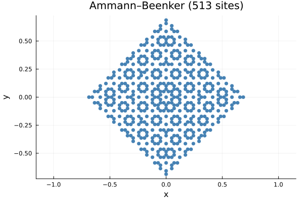
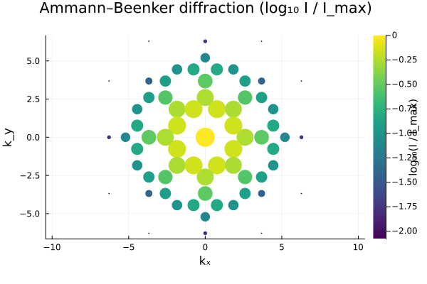

# Ammann–Beenker tiling

The Ammann–Beenker tiling is a 2D quasicrystal with 8-fold
rotational symmetry built from the 4D host lattice
$\mathbb{Z}^4$. The five physical star vectors are
$v_k = (\cos k\pi/4, \sin k\pi/4)$ for $k = 0, 1, 2, 3$;
the perpendicular space is 2D and the acceptance window is a
square of half-width $1/2$ (`BoxWindow{2}`).

## Real space

The projected point set is a dense packing of unit squares and
$45°$ rhombi. It is **not** periodic, but every finite patch
appears infinitely often in the tiling (repetitivity).



```julia
using Plots, LatticeCore, QuasiCrystal
qc = generate_ammann_beenker_projection(8.0)
plot_lattice(qc; title="Ammann–Beenker ($(num_sites(qc)) sites)")
```

## Reciprocal space — Bragg peaks

The Bragg peak set is (numerically) closed under 90° rotation —
it inherits the C₄ symmetry of the host lattice through the
parallel/perpendicular projection pair. The canonical 8-fold
symmetry requires an octagonal acceptance window in a
Galois-conjugate perpendicular plane; that variant is future
work, but the current square-window version is still a
well-defined cut-and-project pattern.



```julia
peaks = bragg_peaks(qc; kmax = 8.0, intensity_cutoff = 1e-4)
diffraction_pattern(peaks; log_intensity = true, marker_scale = 14.0,
                    title = "Ammann–Beenker diffraction (log₁₀ I / I_max)")
```

## What to check visually

- The plot is centred on Γ (the bright dot at the origin).
- The peak set is symmetric under 90° rotation about Γ.
- Bright peaks cluster in rings at radii determined by the
  shortest non-zero projected reciprocal vectors. Farther-out
  rings have lower intensity (larger $\pi_\perp$).
- `log_intensity = true` is essential here — without it, Γ
  dwarfs every other peak and you can't see the secondary
  structure.
