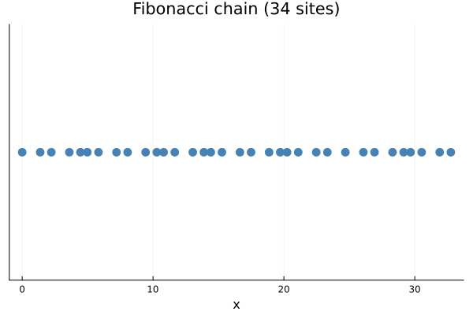
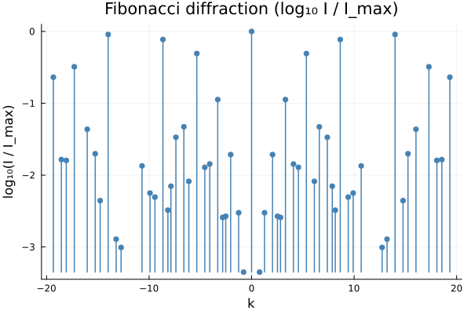

# Fibonacci chain

The Fibonacci chain is a 1D quasicrystal built from the
2D host lattice $\mathbb{Z}^2$ by projecting onto the line
$E_\parallel = \mathrm{span}\{(1, 1/\varphi)\}$ and accepting
points whose $E_\perp$ component lands in a finite interval
(`IntervalWindow`). $\varphi = (1 + \sqrt{5})/2$ is the golden
ratio.

## Real space

Each tick is a site of the point set returned by
`generate_fibonacci_projection`. The inter-site spacing
alternates between two values whose ratio is $\varphi$ — that
"L/S" pattern is the defining feature of the chain.



Code that produced the figure:

```julia
using Plots, LatticeCore, QuasiCrystal
qc = generate_fibonacci_projection(34)
plot_lattice(qc; title="Fibonacci chain ($(num_sites(qc)) sites)")
```

## Reciprocal space — Bragg peaks

The diffraction pattern is a dense set of Bragg peaks on the
line. On a log-intensity plot ($\log_{10} I / I_\mathrm{max}$)
you can see the characteristic self-similar structure of the
Fibonacci chain: the brightest peaks are at integer multiples of
$2\pi/\varphi$ and $2\pi$, and the decaying secondary peaks fill
in between.



```julia
peaks = bragg_peaks(qc; kmax = 20.0, intensity_cutoff = 1e-4)
diffraction_pattern(peaks; log_intensity = true,
                    title = "Fibonacci diffraction (log₁₀ I / I_max)")
```

## What to check visually

- The stem plot is symmetric under $k \to -k$ (the chain is
  real, so intensities are even).
- The tallest stem sits exactly at $k = 0$ (Γ), with
  $\log_{10} I / I_\mathrm{max} = 0$.
- Sub-dominant peaks cluster around golden-ratio multiples of
  the brightest ones; you can read the ratio off the log plot.
