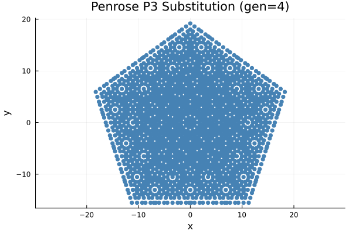

# Penrose P3 tiling

Penrose P3 is the 5-fold quasicrystal built from the 5D host
lattice $\mathbb{Z}^5$. Its physical star consists of the five
vectors $v_k = (\cos 2\pi k / 5, \sin 2\pi k / 5)$. The
perpendicular space is 3D, and the currently shipped generator
uses a cubic acceptance window
(`BoxWindow{3}(SVector(0.5, 0.5, 0.5))`).

## Real space

The point set is dense but aperiodic, and the distribution of
nearest-neighbour distances shows the hallmark 5-fold structure
even without drawing the rhombi.


```julia
using Plots, LatticeCore, QuasiCrystal
qc = generate_penrose_projection(8.0)
plot_lattice(qc; title="Penrose P3 ($(num_sites(qc)) sites)")
```

## Substitution Method

An alternative way to generate Penrose tilings is via substitution rules (L-systems or matching rules). A cluster (such as a "Sun" configuration of 5 rhombi) is repeatedly deflated and rescaled, creating a larger region of the exact quasiperiodic sequence.



## Diffraction Pattern

The structure factor confirms the sharp, dense Bragg peaks characteristic of quasi-periodic order, forming a classic 10-fold symmetric diffraction pattern.


```julia
peaks = bragg_peaks(qc; kmax = 8.0, intensity_cutoff = 1e-4)
diffraction_pattern(peaks; log_intensity = true, marker_scale = 14.0,
                    title = "Penrose P3 diffraction (log₁₀ I / I_max)")
```

## What to check visually

- Γ is the single brightest dot at the centre.
- The next ring of five (or ten, counting the $k \to -k$
  partner) bright peaks forms a regular decagon around Γ.
- Sub-rings of fainter peaks appear between the main decagons,
  closed under the same 72° rotation.
- The canonical Penrose pattern has a sharper pentagonal
  window in a 2D Galois-conjugate perpendicular plane — that
  variant is future work, see the follow-up note in
  `src/core/fourier/fourier.jl`.
